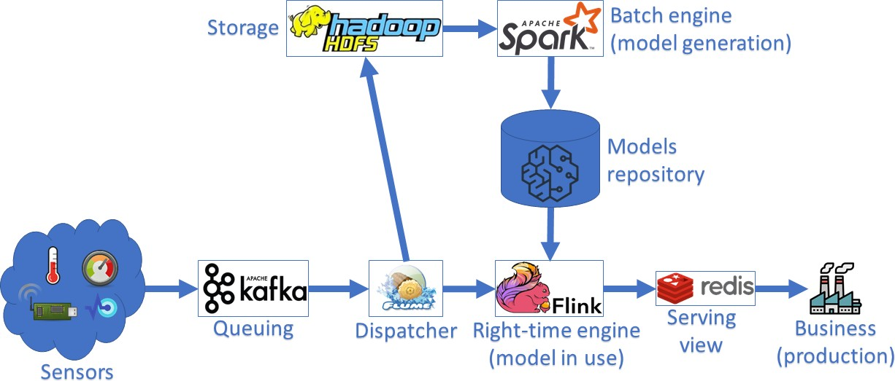

# 09-Architectures

## 9.1 **Theoretical questions**

1. What problem do Data Lakes solve?

## 9.2 **Problems**

1. Consider the software architecture below and briefly explain the main **management (maintenance) risk** it has.
    
    